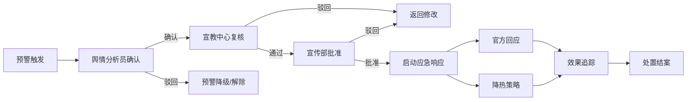

# 全国网络舆情传播与应急响应智能分析平台 PRD

## 1. 产品概述

全国网络舆情传播与应急响应智能分析平台是面向国家、省、市三级网信部门的专业舆情监测与应急响应系统，实时接入微博、微信、新闻客户端、论坛及短视频等多源社交媒体数据，通过AI算法自动完成情感分析、敏感词识别和传播路径追踪，实现舆情态势感知、智能预警、应急响应和决策辅助的全流程闭环管理。

- 核心目标：构建全国一体化舆情监测体系，提升网络舆情发现力、研判力、处置力
- 目标用户：国家网信办、各省/市网信办、宣传部、宣教中心等舆情管理部门
- 市场价值：填补三级联动舆情应急响应空白，将传统人工监测升级为AI驱动的智能决策系统

## 2. 核心功能

### 2.1 用户角色与权限

| 角色 | 层级 | 核心权限 |
|------|------|----------|
| 国家级管理员 | 国家 | 全国数据查看、全局配置管理、用户权限分配 |
| 省级管理员 | 省 | 本省数据查看、省级报表生成、市级用户管理 |
| 市级管理员 | 市 | 本市数据查看、市级报表生成、事件处置 |
| 舆情分析员 | 三级 | 舆情事件确认、分析报告撰写、预警核查 |
| 宣教中心 | 三级 | 舆情处置复核、宣传策略制定、发言人管理 |
| 宣传部 | 三级 | 应急响应批准、官方回应审批、降热策略审批 |
| 值班员 | 三级 | 预警消息接收、事件监控、日常巡检 |

### 2.2 功能模块总览

1. **核心看板**：全国舆情热力图、情感分布排名、实时热度指数、关键数据指标卡
2. **舆情监测**：多源数据接入、实时数据清洗、情感极性标注、敏感词识别
3. **事件中心**：事件聚合、传播路径图谱、意见领袖排名、评论关键词云
4. **预警中心**：阈值配置、自动预警推送、预警分级管理、预警处置记录
5. **审批流程**：三级审批（舆情分析员→宣教中心→宣传部）、审批流转、审批记录
6. **应急响应**：官方回应管理、降热策略执行、辟谣追踪、处置效果评估
7. **预案管理**：年度宣传预案上传、关键节点提取、72小时风险预测
8. **智能推荐**：最优发言人推荐、发声渠道组合推荐、引导策略推荐
9. **报表中心**：周/月/季/年度报表、自定义报表、数据导出
10. **系统管理**：用户管理、权限配置、系统设置、操作日志

### 2.3 页面详情

| 页面名称 | 模块名称 | 功能描述 |
|----------|----------|----------|
| 登录页 | 登录模块 | 账号密码登录、三级层级选择、安全验证 |
| 核心看板 | 数据概览卡 | 今日舆情总量、负面占比、预警数量、在办事件数 |
| 核心看板 | 全国热力图 | 按省份展示舆情热度分布，支持点击下钻到省级 |
| 核心看板 | 情感分布排名 | 正面/中性/负面情感占比柱状图，省份排名 |
| 核心看板 | 实时舆情流 | 滚动展示最新舆情数据，标注情感极性 |
| 核心看板 | 热门事件榜 | TOP10热门事件，热度指数、传播速度、情感倾向 |
| 事件列表页 | 筛选工具栏 | 按时间、地域、情感、事件类别多维度筛选 |
| 事件列表页 | 事件卡片列表 | 事件标题、摘要、热度、情感、来源、时间 |
| 事件详情页 | 事件基本信息 | 事件标题、描述、发生时间、涉及地域、热度趋势 |
| 事件详情页 | 传播路径图谱 | 近7天传播路径可视化，节点大小表示影响力 |
| 事件详情页 | 意见领袖排名 | TOP20关键节点，粉丝数、转发量、影响力指数 |
| 事件详情页 | 评论关键词云 | 网民评论高频词可视化，颜色深浅表示情感倾向 |
| 事件详情页 | 数据趋势图 | 热度指数、情感得分、传播速度随时间变化曲线 |
| 预警中心 | 预警列表 | 一级/二级/三级预警分类展示，预警状态筛选 |
| 预警中心 | 预警详情 | 预警触发条件、关联事件、推送记录、处置记录 |
| 审批中心 | 待办审批 | 舆情分析员待确认、宣教中心待复核、宣传部待批准 |
| 审批中心 | 审批详情 | 审批意见填写、附件上传、审批流转记录 |
| 审批中心 | 已办审批 | 历史审批记录查询 |
| 预案管理 | 预案列表 | 年度宣传引导预案管理，支持上传Excel |
| 预案管理 | 预案解析 | 自动提取关键节点、重要时间点、策略要点 |
| 预案管理 | 风险预测 | 基于历史数据预测未来72小时高风险事件 |
| 预案管理 | 智能推荐 | 最优发言人安排、发声渠道组合推荐 |
| 报表中心 | 每周诊断报告 | 情感变化同比环比、传播效率排名、辟谣响应时长 |
| 报表中心 | 趋势对比 | 上周/上月趋势对比，策略优化建议 |
| 报表中心 | 培训重点推荐 | 基于数据分析推荐舆情引导培训重点 |
| 系统管理 | 用户管理 | 三级用户增删改查、角色分配 |
| 系统管理 | 权限管理 | 角色权限配置、数据范围设置 |
| 系统管理 | 预警阈值配置 | 负面占比阈值、热度阈值、持续时间配置 |
| 系统管理 | 操作日志 | 全系统操作审计记录 |

## 3. 核心业务流程

### 3.1 舆情监测与预警流程

多源数据实时接入 → 数据清洗与标准化 → 情感极性标注与敏感词识别 → 按事件/地域/时段聚合 → 实时计算热度指数与情感得分 → 阈值比对 → 触发预警 → 推送至值班员

### 3.2 应急响应审批流程

预警触发 → 舆情分析员确认 → 宣教中心复核 → 宣传部批准 → 启动官方回应/降热策略 → 执行效果追踪 → 处置结案

### 3.3 预案与预测流程

上传年度预案Excel → 自动解析关键节点 → 结合历史舆情数据 → 72小时风险预测 → 生成风险事件列表 → 推荐发言人组合 → 推荐发声渠道 → 生成引导策略方案

## 4. 用户界面设计

### 4.1 设计风格

- **设计主题**：政务科技风，专业、严谨、高效、可信赖
- **主色调**：深蓝渐变（#0F2C59 → #1B4B8A），代表权威与专业
- **辅助色**：
  - 正面情感：#22C55E（绿色）
  - 中性情感：#3B82F6（蓝色）
  - 负面情感：#EF4444（红色）
  - 预警色：#F59E0B（橙色）
  - 一级预警：#DC2626（深红）
- **背景**：深色系为主，#0A1628 至 #0F2C59 渐变，符合监控大屏视觉习惯
- **卡片风格**：半透明玻璃态（glassmorphism），边框微光效果
- **字体**：
  - 标题：思源黑体 / PingFang SC，加粗
  - 正文：思源黑体 / PingFang SC，常规
  - 数据数字：等宽字体，增强数据可读性
- **图标风格**：线性图标，统一2px描边，与整体科技风格一致

### 4.2 布局设计

- 整体采用左侧导航 + 顶部栏 + 主内容区的经典布局
- 左侧导航：可折叠，图标+文字，支持三级层级切换
- 顶部栏：面包屑导航、用户信息、消息通知、全局搜索
- 主内容区：网格化布局，支持响应式适配
- 数据大屏模式：核心看板支持全屏展示

### 4.3 页面设计概览

| 页面名称 | 模块名称 | UI设计要点 |
|----------|----------|-------------|
| 核心看板 | 热力图模块 | 中国地图SVG，省份渐变着色，悬停显示详情，点击下钻 |
| 核心看板 | 数据卡片 | 半透明玻璃卡片，数据大号字体，趋势指标带箭头 |
| 核心看板 | 实时流 | 滚动列表，情感色标，来源图标，微动画效果 |
| 事件详情 | 传播图谱 | 力导向图，节点大小表示影响力，连线表示传播关系 |
| 事件详情 | 关键词云 | 词频标签云，颜色表示情感倾向，悬停显示词频 |
| 预警中心 | 预警卡片 | 三级预警配色区分，闪烁动画，倒计时显示 |
| 审批中心 | 审批流 | 横向时间轴，当前步骤高亮，已完成步骤打勾 |
| 报表中心 | 图表组 | 多图表组合布局，支持切换维度，数据可导出 |

### 4.4 动效设计

- 页面加载：元素渐入+上移动画，错落延迟
- 数据更新：数字滚动变化，平滑过渡
- 预警提示：脉冲动画 + 数字角标闪烁
- 卡片悬停：轻微上浮 + 边框发光
- 地图交互：省份高亮 + 信息气泡弹出
- 图表动画：数据渐进式加载，柱图/折线从0生长

### 4.5 响应式设计

- 桌面端优先设计，适配1920×1080及以上分辨率
- 平板端：导航自动折叠，布局自适应调整
- 移动端：底部Tab导航，卡片单列布局，图表简化展示
- 核心看板支持大屏展示模式（F11全屏）

### 4.6 数据可视化指导

- 地图：SVG中国地图，支持省级/市级下钻
- 传播图谱：D3.js力导向图，节点可拖拽
- 关键词云：词云组件，支持情感着色
- 趋势图：面积图/折线图，支持多维度叠加
- 排名榜：横向柱状图，带动画效果
- 仪表盘：环形进度图，情感得分展示
