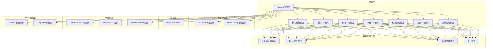

# 全国网络舆情传播与应急响应智能分析平台 技术架构文档

## 1. 架构设计



## 2. 技术栈说明

### 2.1 核心框架

| 技术 | 版本 | 用途 |
|------|------|------|
| React | 18.x | 前端核心框架，函数式组件 + Hooks |
| TypeScript | 5.x | 类型安全，提升代码可维护性 |
| Vite | 5.x | 构建工具，快速开发与打包 |
| React Router | 6.x | 前端路由管理 |
| TailwindCSS | 3.x | 原子化CSS框架 |

### 2.2 数据可视化

| 技术 | 版本 | 用途 |
|------|------|------|
| ECharts | 5.x | 主流图表库，热力图、折线图、柱状图等 |
| D3.js | 7.x | 力导向图、自定义可视化 |
| react-wordcloud | - | 关键词云可视化 |
| echarts-wordcloud | - | ECharts词云扩展 |

### 2.3 状态管理与数据

| 技术 | 版本 | 用途 |
|------|------|------|
| Zustand | 4.x | 轻量级全局状态管理 |
| @tanstack/react-query | 5.x | 服务端状态管理、数据缓存 |
| Mock.js | 1.x | 模拟数据生成 |

### 2.4 UI组件与动画

| 技术 | 版本 | 用途 |
|------|------|------|
| Headless UI | 2.x | 无样式组件库，可定制化高 |
| Framer Motion | 11.x | 流畅的动画效果 |
| lucide-react | - | 统一的图标库 |
| clsx | - | className条件拼接工具 |

### 2.5 工程化

| 技术 | 版本 | 用途 |
|------|------|------|
| ESLint | 8.x | 代码规范检查 |
| Prettier | 3.x | 代码格式化 |
| TypeScript ESLint | - | TypeScript代码检查 |

## 3. 目录结构

```
src/
├── assets/              # 静态资源
│   ├── images/
│   ├── icons/
│   └── fonts/
├── components/          # 通用组件
│   ├── ui/             # 基础UI组件
│   │   ├── Button/
│   │   ├── Card/
│   │   ├── Modal/
│   │   ├── Table/
│   │   └── ...
│   ├── layout/         # 布局组件
│   │   ├── Sidebar/
│   │   ├── Header/
│   │   └── MainLayout/
│   └── charts/         # 图表组件
│       ├── HeatMap/
│       ├── LineChart/
│       ├── BarChart/
│       ├── WordCloud/
│       └── ForceGraph/
├── pages/              # 页面组件
│   ├── Dashboard/      # 核心看板
│   ├── Events/         # 事件中心
│   ├── Warning/        # 预警中心
│   ├── Approval/       # 审批中心
│   ├── Plan/           # 预案管理
│   ├── Report/         # 报表中心
│   ├── System/         # 系统管理
│   └── Login/          # 登录页
├── hooks/              # 自定义Hooks
│   ├── useAuth.ts
│   ├── usePermission.ts
│   ├── useDashboard.ts
│   └── ...
├── store/              # 状态管理
│   ├── useUserStore.ts
│   ├── useAppStore.ts
│   └── ...
├── services/           # API服务
│   ├── request.ts      # 请求封装
│   ├── dashboard.ts
│   ├── events.ts
│   ├── warning.ts
│   └── ...
├── mock/               # Mock数据
│   ├── index.ts
│   ├── dashboard.ts
│   ├── events.ts
│   ├── warning.ts
│   └── ...
├── types/              # TypeScript类型定义
│   ├── index.ts
│   ├── dashboard.ts
│   ├── events.ts
│   └── ...
├── utils/              # 工具函数
│   ├── format.ts
│   ├── permission.ts
│   ├── date.ts
│   └── ...
├── styles/             # 全局样式
│   ├── index.css
│   └── variables.css
├── router/             # 路由配置
│   └── index.tsx
├── App.tsx
├── main.tsx
└── vite-env.d.ts
```

## 4. 路由定义

| 路由路径 | 页面名称 | 权限等级 | 说明 |
|----------|----------|----------|------|
| /login | 登录页 | 公开 | 用户登录入口 |
| /dashboard | 核心看板 | 三级 | 全国/本省/本市舆情总览 |
| /events | 事件列表 | 三级 | 舆情事件列表与筛选 |
| /events/:id | 事件详情 | 三级 | 事件传播路径、意见领袖、关键词云 |
| /warning | 预警中心 | 三级 | 预警列表与预警详情 |
| /approval/todo | 待办审批 | 分析员/宣教/宣传 | 三级审批待办事项 |
| /approval/done | 已办审批 | 分析员/宣教/宣传 | 历史审批记录 |
| /plan | 预案管理 | 宣教/宣传 | 预案上传与风险预测 |
| /plan/:id | 预案详情 | 宣教/宣传 | 预案解析与推荐方案 |
| /report/weekly | 每周诊断报告 | 三级 | 周度舆情诊断报告 |
| /report/custom | 自定义报表 | 三级 | 自定义维度报表 |
| /system/users | 用户管理 | 管理员 | 三级用户管理 |
| /system/roles | 角色权限 | 管理员 | 角色与权限配置 |
| /system/settings | 系统设置 | 管理员 | 预警阈值等系统配置 |
| /system/logs | 操作日志 | 管理员 | 系统操作审计日志 |

## 5. 核心数据模型

### 5.1 用户与权限模型

```typescript
interface User {
  id: string;
  username: string;
  realName: string;
  avatar?: string;
  level: 'national' | 'provincial' | 'municipal';
  region: {
    code: string;
    name: string;
  };
  role: Role;
  status: 'active' | 'disabled';
  lastLogin?: Date;
  createdAt: Date;
}

interface Role {
  id: string;
  name: string;
  code: string;
  permissions: Permission[];
}

interface Permission {
  id: string;
  name: string;
  code: string;
  type: 'menu' | 'button' | 'data';
}
```

### 5.2 舆情数据模型

```typescript
interface OpinionItem {
  id: string;
  title: string;
  content: string;
  source: 'weibo' | 'wechat' | 'news' | 'forum' | 'video';
  sourceUrl: string;
  author: {
    id: string;
    name: string;
    avatar?: string;
    followers?: number;
  };
  publishTime: Date;
  emotion: 'positive' | 'neutral' | 'negative';
  emotionScore: number;
  sensitiveWords: string[];
  region: {
    province: string;
    city?: string;
  };
  repostCount: number;
  commentCount: number;
  likeCount: number;
  heatIndex: number;
  eventId?: string;
}
```

### 5.3 事件模型

```typescript
interface Event {
  id: string;
  title: string;
  description: string;
  category: string;
  level: 1 | 2 | 3 | 4;
  status: 'active' | 'cooling' | 'resolved';
  region: {
    provinces: string[];
    cities?: string[];
  };
  startTime: Date;
  peakTime?: Date;
  endTime?: Date;
  heatIndex: number;
  heatTrend: 'rising' | 'stable' | 'falling';
  emotionScore: number;
  negativeRatio: number;
  spreadSpeed: number;
  sourceCount: number;
  opinionCount: number;
  keyNodes: KeyNode[];
  spreadPath: SpreadNode[];
  topKeywords: KeywordItem[];
  createdAt: Date;
  updatedAt: Date;
}

interface KeyNode {
  id: string;
  name: string;
  avatar?: string;
  source: string;
  followers: number;
  influenceIndex: number;
  repostCount: number;
  commentCount: number;
  isOpinionLeader: boolean;
}

interface SpreadNode {
  id: string;
  name: string;
  level: number;
  children: SpreadNode[];
  influence: number;
}

interface KeywordItem {
  word: string;
  count: number;
  emotion: 'positive' | 'neutral' | 'negative';
}
```

### 5.4 预警模型

```typescript
interface Warning {
  id: string;
  eventId: string;
  eventTitle: string;
  level: 1 | 2 | 3;
  triggerType: 'negative_ratio' | 'heat_threshold' | 'sensitive_word';
  triggerCondition: {
    type: string;
    threshold: number;
    actualValue: number;
    duration: number;
  };
  status: 'pending' | 'confirmed' | 'processing' | 'resolved' | 'dismissed';
  region: string;
  pushTargets: string[];
  pushTime: Date;
  confirmTime?: Date;
  resolveTime?: Date;
  handler?: string;
  approvalFlowId?: string;
  createdAt: Date;
}
```

### 5.5 审批流程模型

```typescript
interface ApprovalFlow {
  id: string;
  warningId: string;
  eventId: string;
  eventTitle: string;
  type: 'official_response' | 'cooling_strategy' | 'rumor_refutation';
  status: 'pending_analyst' | 'pending_edu' | 'pending_propaganda' | 'approved' | 'rejected';
  currentStep: number;
  steps: ApprovalStep[];
  initiator: string;
  initiatorDept: string;
  createdAt: Date;
  updatedAt: Date;
}

interface ApprovalStep {
  step: number;
  role: string;
  handler?: string;
  opinion?: string;
  attachments?: string[];
  status: 'pending' | 'approved' | 'rejected';
  handleTime?: Date;
}
```

### 5.6 预案模型

```typescript
interface Plan {
  id: string;
  name: string;
  year: number;
  type: string;
  description: string;
  fileUrl: string;
  keyNodes: PlanKeyNode[];
  riskPredictions: RiskPrediction[];
  speakerRecommendations: SpeakerRec[];
  channelRecommendations: ChannelRec[];
  status: 'draft' | 'active' | 'archived';
  createdAt: Date;
  createdBy: string;
}

interface PlanKeyNode {
  id: string;
  title: string;
  date: Date;
  type: string;
  description: string;
  riskLevel: 'high' | 'medium' | 'low';
}

interface RiskPrediction {
  id: string;
  eventType: string;
  probability: number;
  riskLevel: 'high' | 'medium' | 'low';
  predictedTime: Date;
  predictedRegion: string[];
  relatedHistoryEvents: string[];
  suggestions: string[];
}

interface SpeakerRec {
  id: string;
  name: string;
  title: string;
  department: string;
  expertise: string[];
  suitabilityScore: number;
  reason: string;
}

interface ChannelRec {
  id: string;
  channel: string;
  channelType: string;
  audienceCoverage: number;
  effectivenessScore: number;
  recommendedTime: string;
  reason: string;
}
```

### 5.7 报表模型

```typescript
interface WeeklyReport {
  id: string;
  week: string;
  startDate: Date;
  endDate: Date;
  region: string;
  summary: {
    totalOpinions: number;
    weekOnWeek: number;
    positiveRatio: number;
    positiveWoW: number;
    negativeRatio: number;
    negativeWoW: number;
    warningCount: number;
    warningWoW: number;
    avgResponseTime: number;
    responseTimeWoW: number;
  };
  emotionTrend: DailyEmotionData[];
  spreadEfficiencyRanking: RegionRankItem[];
  rumorResponseStats: RumorStat[];
  strategyRecommendations: StrategyRec[];
  trainingFocuses: TrainingFocus[];
  generatedAt: Date;
}

interface DailyEmotionData {
  date: string;
  positive: number;
  neutral: number;
  negative: number;
}

interface RegionRankItem {
  region: string;
  spreadSpeed: number;
  responseSpeed: number;
  efficiencyScore: number;
  rank: number;
  trend: 'up' | 'down' | 'stable';
}

interface RumorStat {
  rumorId: string;
  rumorTitle: string;
  spreadCount: number;
  responseTime: number;
  refutationEffect: number;
}

interface StrategyRec {
  id: string;
  category: string;
  content: string;
  priority: 'high' | 'medium' | 'low';
  basis: string;
}

interface TrainingFocus {
  id: string;
  topic: string;
  reason: string;
  priority: 'high' | 'medium' | 'low';
  suggestedTrainingType: string;
}
```

## 6. 状态管理设计

### 6.1 用户状态

- 存储用户信息、权限、当前层级
- 持久化到localStorage
- 登录/登出方法

### 6.2 应用状态

- 侧边栏折叠状态
- 当前主题（暗色/亮色）
- 全屏模式
- 通知消息列表

### 6.3 数据状态

- 使用React Query管理服务端数据
- 缓存策略：热点数据5分钟，列表数据1分钟
- 自动重试：失败重试2次

## 7. 性能优化策略

1. **代码分割**：按路由级别代码分割，首屏加载优化
2. **懒加载**：图表组件、大型组件动态导入
3. **虚拟列表**：长列表数据虚拟滚动
4. **数据缓存**：React Query缓存减少重复请求
5. **按需加载**：ECharts按需引入图表类型
6. **图片优化**：WebP格式、懒加载、占位图

## 8. 安全策略

1. **路由守卫**：基于角色权限控制路由访问
2. **数据权限**：根据用户层级过滤数据范围
3. **Token认证**：JWT Token存储与刷新
4. **操作审计**：关键操作记录审计日志
5. **敏感信息**：敏感数据脱敏展示

## 9. 响应式适配

- 断点设计：sm(640px)、md(768px)、lg(1024px)、xl(1280px)、2xl(1536px)
- 桌面优先设计，渐进式降级
- 导航自适应：侧边栏→顶部栏→底部Tab
- 图表自适应：容器尺寸变化自动重绘
